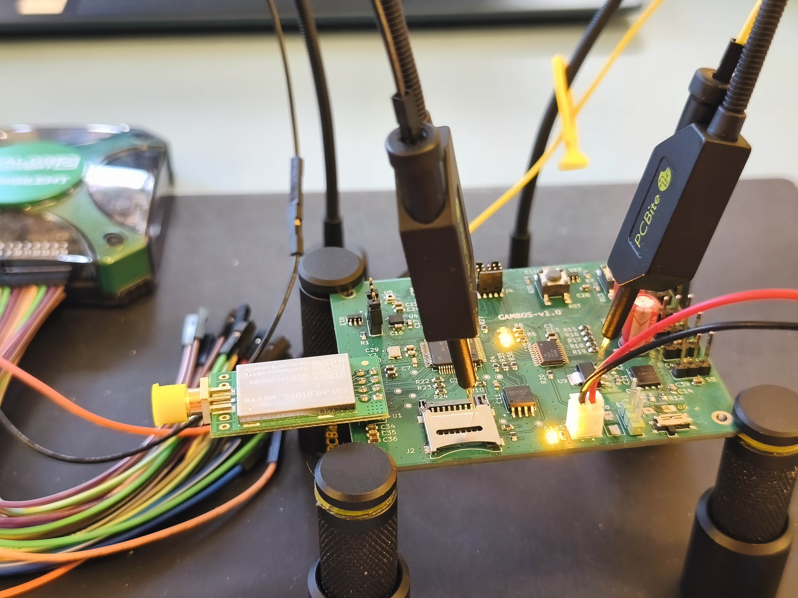

# Gambos flight controller

Custom **STM32F446** flight-controller PCB and firmware — schematic through layout, manufacture, assembly, bring-up, application and driver development.

## At a glance

|               |                                                                        |
| ------------- | ---------------------------------------------------------------------- |
| **MCU**       | STM32F446RET6 (Cortex-M4 + FPU)                                        |
| **Sensors**   | Accelerometer, gyroscope, magnetometer, barometer, temperature         |
| **Storage**   | External SPI flash + microSD                                           |
| **Actuation** | 5× hobby servo PWM, ESC motor PWM                                      |
| **Wireless**  | nRF24L01+ telemetry / command link                                     |
| **Debug**     | SWD + UART (SEGGER J-Link)                             |
| **PCB**       | 4-layer, 75 × 50 mm — KiCad, manufactured**v1.0**                      |
| **Firmware**  | CMake, FreeRTOS —`devkit` and `custom` targets                         |
| **Status**    | v1.0 built; hardware bring-up in progress; flight software in progress |

## System overview (hardware)

  

Buses, actuation, and interfaces are described in [System architecture](docs/hardware/architecture.md).

## Bring-up setup

  

## Hardware

Custom board in KiCad (not a dev-kit stack), split by subsystem: power, sensing, storage, RF, actuation.

| Topic                       | Documentation                                                                        |
| --------------------------- | ------------------------------------------------------------------------------------ |
| Architecture, buses, PWM    | [docs/hardware/architecture.md](docs/hardware/architecture.md)                       |
| Stackup, layout             | [docs/hardware/physical-design.md](docs/hardware/physical-design.md)                 |
| Power, storage, sensing, UI | [docs/hardware/](docs/hardware/) — see [documentation index](docs/index.md#hardware) |
| KiCad project               | `[hardware/gambos-pcb.kicad_pro](hardware/gambos-pcb.kicad_pro)`                     |

## Software

Firmware targets the **Nucleo-F446RE** (`devkit`) for early work and the **Gambos PCB** (`custom`). Build, flash, and the dev container workflow are documented; the in-flight stack is still being brought up.

|            |                                                  |
| ---------- | ------------------------------------------------ |
| **RTOS**   | FreeRTOS                                         |
| **Layout** | `board/` (CubeMX + HAL) and `app/` (application) |

### Software architecture *(documentation in progress)*

Sections below are placeholders — fill them in as the stack stabilizes.

#### Firmware layout

*(pending)*

#### RTOS and tasks

*(pending)*

#### Drivers and peripherals

*(pending)*

#### Estimation and control

*(pending)*

| Getting started                    | Link                                             |
| ---------------------------------- | ------------------------------------------------ |
| Build, flash, debug, dev container | [software/README.md](software/README.md)         |
| Software doc hub                   | [docs/software/index.md](docs/software/index.md) |

## Documentation

Full index: **[docs/index.md](docs/index.md)**

**Hardware** (read in order after this page):

1. [System architecture](docs/hardware/architecture.md)
2. [Physical design](docs/hardware/physical-design.md)
3. [Power](docs/hardware/power.md) → [Storage](docs/hardware/storage.md) → [Sensing](docs/hardware/sensing.md) → [User interface](docs/hardware/user-interface.md)
4. [Future improvements](docs/hardware/future-improvements.md)

**Software:** [docs/software/index.md](docs/software/index.md) → [software/README.md](software/README.md)

## Repository layout

| Directory                | Purpose                                         |
| ------------------------ | ----------------------------------------------- |
| `[hardware/](hardware/)` | KiCad project, libraries, manufacturing outputs |
| `[software/](software/)` | STM32 firmware (CMake, FreeRTOS)                |
| `[docs/](docs/)`         | Hardware and software documentation, figures    |
