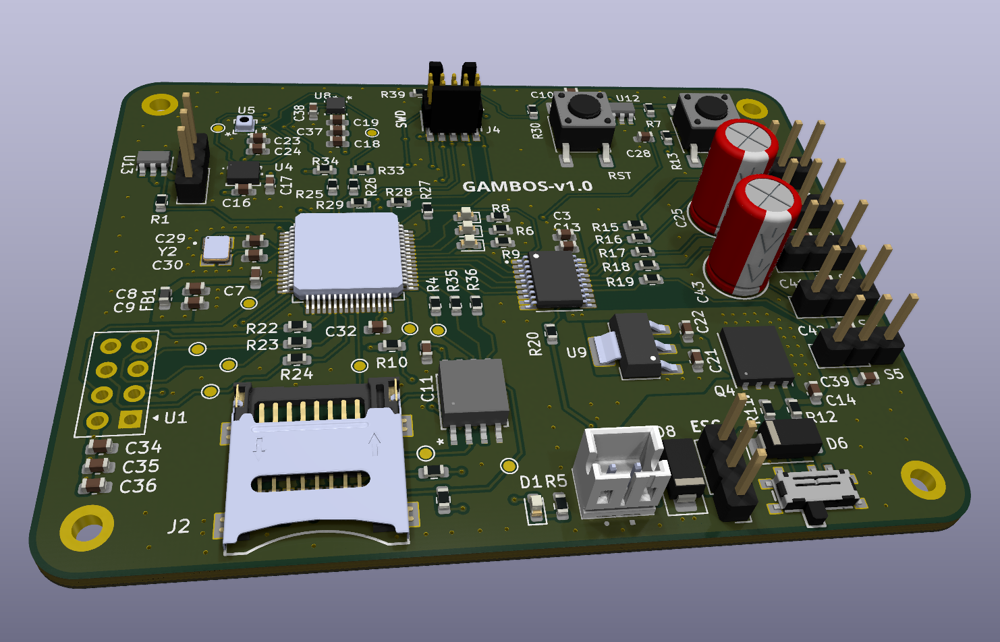

# Gambos flight controller

Custom **STM32F446** flight-controller PCB and firmware — schematic through layout, manufacture, assembly, bring-up, application and driver development.

## At a glance

|               |                                                                        |
| ---------------| ------------------------------------------------------------------------|
| **MCU**       | STM32F446RET6 (Cortex-M4 + FPU)                                        |
| **Sensors**   | Accelerometer, gyroscope, magnetometer, barometer, temperature         |
| **Storage**   | External flash + microSD                                               |
| **Actuation** | 5× hobby servo PWM, ESC motor PWM                                      |
| **Wireless**  | nRF24L01+ telemetry / command link                                     |
| **Debug**     | SWD + UART (SEGGER J-Link)                                             |
| **PCB**       | 4-layer, 75 × 50 mm — KiCad, manufactured **v1.0**                     |
| **Firmware**  | CMake, FreeRTOS —`devkit` and `custom` targets                         |
| **Status**    | v1.0 built; hardware bring-up in progress; flight software in progress |
| **Schematic** | [Gambos PCB schematic (PDF)](docs/gambos-pcb.pdf) — KiCad export, v1.0 |

## Schematic (v1.0)

The full board schematic is published as a PDF:

**[Gambos PCB schematic (PDF)](docs/gambos-pcb.pdf)**

The editable design lives in the KiCad project under [`hardware/`](hardware/); the PDF is an export of that source.

## Render and Bring-up setup

  <table cellspacing="0" cellpadding="12">
    <tr>
      <td align="center" valign="top">
        
         
        3D PCB render
      </td>
      <td align="center" valign="top">
        
         
        Testing the power section on the bench
      </td>
    </tr>
  </table>

Render of v1.0 layout in KiCad (left) and early bench bring-up (right), started with the power section before moving to testing other peripherals.

## Hardware block diagram

  
   
  Hardware block diagram

Buses, actuation, and interfaces are described in [Hardware architecture](docs/hardware/hardware-architecture.md).

## Software architecture

*(diagram pending)* — layer stack, drivers, RTOS tasks, and flight logic are described in [Software architecture](docs/software/software-architecture.md).

## Documentation

Full index: **[docs/index.md](docs/index.md)**

**Hardware** (read in order after this page):

1. [Hardware architecture](docs/hardware/hardware-architecture.md)
2. [Physical design](docs/hardware/physical-design.md)
3. [Power](docs/hardware/power.md) → [Storage](docs/hardware/storage.md) → [Sensing](docs/hardware/sensing.md) → [User interface](docs/hardware/user-interface.md)
4. [Roadmap](docs/hardware/roadmap.md) — v1.0 todos and v1.1+ hardware plans

**Software:** [docs/software/software-architecture.md](docs/software/software-architecture.md) → [software/README.md](software/README.md)

## Repository layout

| Directory                | Purpose                                         |
| ------------------------ | ----------------------------------------------- |
| `[hardware/](hardware/)` | KiCad project, libraries, manufacturing outputs |
| `[software/](software/)` | STM32 firmware (CMake, FreeRTOS)                |
| `[docs/](docs/)`         | Hardware and software documentation, figures    |
