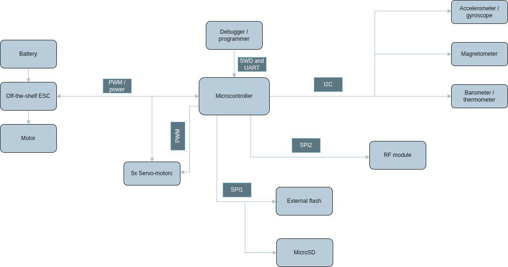
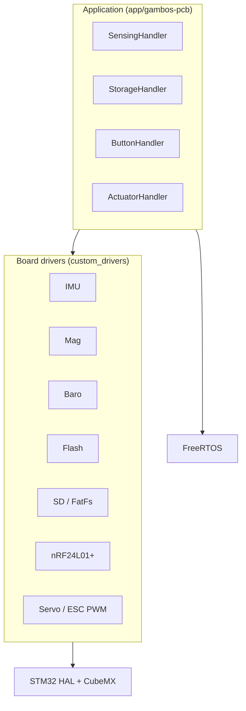

# Gambos flight controller

Custom **STM32F446** flight controller — KiCad PCB through FreeRTOS firmware.
Schematic, layout, manufacture, bring-up, drivers, and application code in one repo.

## At a glance

|               |                                                                                    |
| ---------------| ------------------------------------------------------------------------------------|
| **MCU**       | STM32F446RET6                                                                      |
| **Sensors**   | Accelerometer, gyroscope, magnetometer, barometer, temperature                     |
| **Storage**   | External flash + microSD                                                           |
| **Actuation** | 5× hobby servo PWM, ESC motor PWM                                                  |
| **Wireless**  | nRF24L01+ telemetry / command link                                                 |
| **Debug**     | SWD + UART                                                                         |
| **PCB**       | 4-layer, 75 × 50 mm — KiCad, manufactured **v1.0**                                 |
| **Firmware**  | C++17, FreeRTOS, CMake — custom drivers + handler tasks                            |
| **Status**    | v1.0 PCB built and brought up; sensing + storage running; flight stack in progress |
| **Schematic** | [Gambos PCB schematic (PDF)](docs/gambos-pcb.pdf) — KiCad export, v1.0             |

## What this covers

- **PCB** — 4-layer board in KiCad: power, sensing, storage, actuation, RF (v1.0 manufactured)
- **Bring-up** — power first, then buses and peripherals validated on the bench
- **Drivers** — C++ device drivers for IMU, magnetometer, barometer, external flash, SD, nRF24L01+, hardware PWM
- **Application** — FreeRTOS handler tasks (sensing, storage, UI); CubeMX HAL baseline with a patch workflow for regeneration
- **Toolchain** — CMake build, Dev Container, J-Link debug (workflow docs in [software/README.md](software/README.md))

## Hardware

|               |                                        |
| ------------- | -------------------------------------- |
| 3D render (KiCad) | Bench bring-up — power section     |

v1.0 layout (left) and early bring-up (right). Full schematic: [PDF](docs/gambos-pcb.pdf) · editable source: [hardware/](hardware/)

I2C sensors, SPI storage, separate SPI for RF, PWM actuation — see [Hardware architecture](docs/hardware/hardware-architecture.md).

## Firmware

C++17 on **FreeRTOS**. STM32 HAL and CubeMX-generated init sit at the bottom; board-specific code is in `custom_drivers/`; application logic is split into **handler tasks** under `app/gambos-pcb/` (sensing, storage, button, actuation). Handlers own scheduling and coordinate bus access — e.g. one I2C task for all flight sensors so reads stay ordered.

### Layer stack

```mermaid
flowchart TB
  subgraph handlers["Application (app/gambos-pcb)"]
    SensingHandler
    StorageHandler
    ButtonHandler
    ActuatorHandler
  end
  subgraph drivers["Board drivers (custom_drivers)"]
    LSM6DSVTR["IMU"]
    IIS2MDCTR["Mag"]
    BMP384["Baro"]
    AT25SF128A["Flash"]
    SDCard["SD / FatFs"]
    NRF24["nRF24L01+"]
    HwPwm["Servo / ESC PWM"]
  end
  HAL["STM32 HAL + CubeMX"]
  RTOS["FreeRTOS"]
  handlers --> drivers --> HAL
  handlers --> RTOS
```

Detailed figure and stack notes: [Software architecture](docs/software/software-architecture.md).

### Subsystem status

| Area | State |
| --- | --- |
| Build / flash / debug | Working — [software/README.md](software/README.md) |
| I2C sensing (IMU, mag, baro) | Running on hardware |
| Flash logging + SD export | Implemented (state machine + queue) |
| Button / EXTI | Working |
| Actuation (PWM) | Driver present; handler not wired in app yet |
| RF (nRF24L01+) | Driver present; app integration pending |
| Flight control | Not started |

### Next

Actuator handler integration, RF telemetry/command path, then attitude control and logging policy for flight.

## Documentation

**Index:** [docs/index.md](docs/index.md)

| | |
|---|---|
| **Hardware** | [Architecture](docs/hardware/hardware-architecture.md) → [Physical design](docs/hardware/physical-design.md) → subsystems → [Roadmap](docs/hardware/roadmap.md) |
| **Software** | [Architecture](docs/software/software-architecture.md) · [Build & debug](software/README.md) |

## Repository layout

| Directory                | Purpose                                         |
| ------------------------ | ----------------------------------------------- |
| `[hardware/](hardware/)` | KiCad project, libraries, manufacturing outputs |
| `[software/](software/)` | STM32 firmware (CMake, FreeRTOS)                |
| `[docs/](docs/)`         | Hardware and software documentation, figures    |
