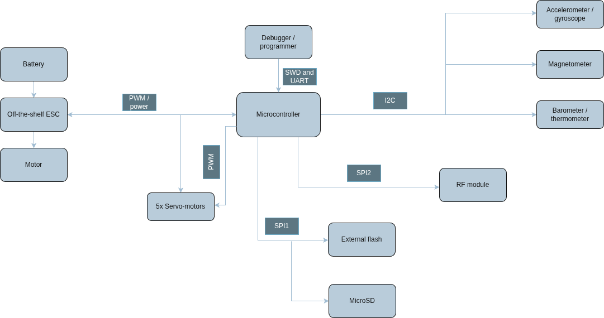

# Hardware architecture

**Schematic:** [Gambos PCB schematic (PDF)](../gambos-pcb.pdf) (KiCad v1.0 export).

## Block diagram

## Digital communication

### Sensors (I2C)

All primary flight sensors (accelerometer, gyroscope, magnetometer, barometer) share one **I2C** bus. This keeps routing and pin usage simple; bandwidth is sufficient at the planned sample rates.

### Non-volatile storage (SPI1)

**External flash** and the **microSD** card share **SPI1**. Flash holds high-rate in-flight logs; the SD card is used after flight to copy data for long-term storage, so firmware can avoid bus contention during flight.

### Telemetry (SPI2)

The **nRF24L01+** uses **SPI2** on its own bus so the RF driver does not share the SPI peripheral with storage devices — simpler firmware and predictable timing.

## Actuation and power control

### Flight surfaces

Five servos are driven by **hardware PWM**. They are powered from the ESC **BEC** rail so high-current inductive loads stay off the logic supply.

### Propulsion

The brushless motor is driven by a dedicated **PWM** signal to the ESC. Battery power routes directly from the Li-Po pack to the ESC high-voltage inputs.

## Debugging and development

### SWD (Serial Wire Debug)

A dedicated header supports flashing, breakpoints, and real-time variable inspection.

### Serial console (UART)

UART on the debug header streams development logs and telemetry during bring-up.

---

**Next:** [Physical design →](physical-design.md)

[Documentation index](../index.md)