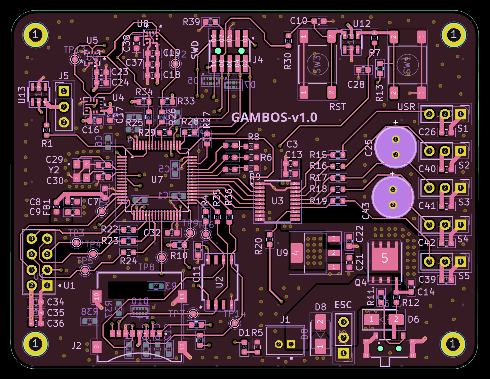

# Physical design

The board uses a **4-layer stackup** for signal integrity and power distribution:

| Layer      | Role           |
| ------------| ----------------|
| 1 (Top)    | Signal / power |
| 2          | Ground plane   |
| 3          | Ground plane   |
| 4 (Bottom) | Signal / power |

Dual internal ground planes give a low-impedance return path. Outer layers use copper pours for thermal spread and to limit warping during reflow and hand soldering.

**Board size:** 75 × 50 mm

  
   
  Top-layer with copper pour

---

**Next:** [Power →](power.md)

[Documentation index](../index.md)