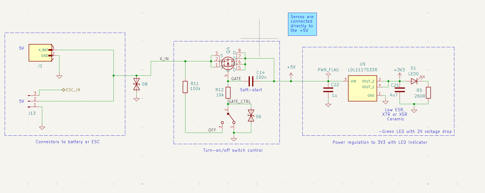

# Power section

The power section includes:

- **Slide switch** — main input enable
- **High-side PMOS switch** — logic-level power control for the servo rail
- **Soft-start capacitor** — limits inrush when enabling the switch
- **LDO** — 5 V (BEC) to 3.3 V for MCU and sensors
- **Bulk and decoupling capacitors** — rail stability
- **Servo headers** — high-current outputs on the BEC path

## Schematic

## High-side PMOS switch

A **high-side PMOS** was chosen to keep the ground reference simple on a 4-layer board. A low-side **NMOS** on the return path was considered but rejected because it can introduce a small ground offset under load — undesirable for mixed analog/digital sensor returns.

The FET is sized for **~750 mA** per servo stall and brief **~5 A** aggregate spikes (stall / startup on multiple servos).

At the intended gate drive, **RDS(on)** is on the order of **10 mΩ**, so conduction loss stays acceptable even during short high-current events.

> **TODO:** Add gate-drive / soft-start simulation plots and measured rail waveforms after v1.0 bring-up.

## Related documentation

- [System architecture](architecture.md)
- [Physical design](physical-design.md)
