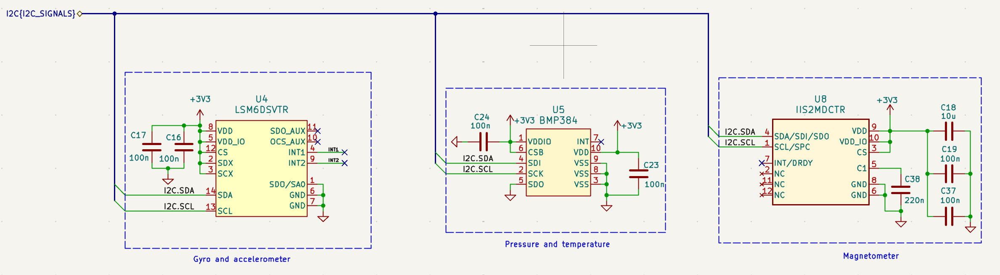
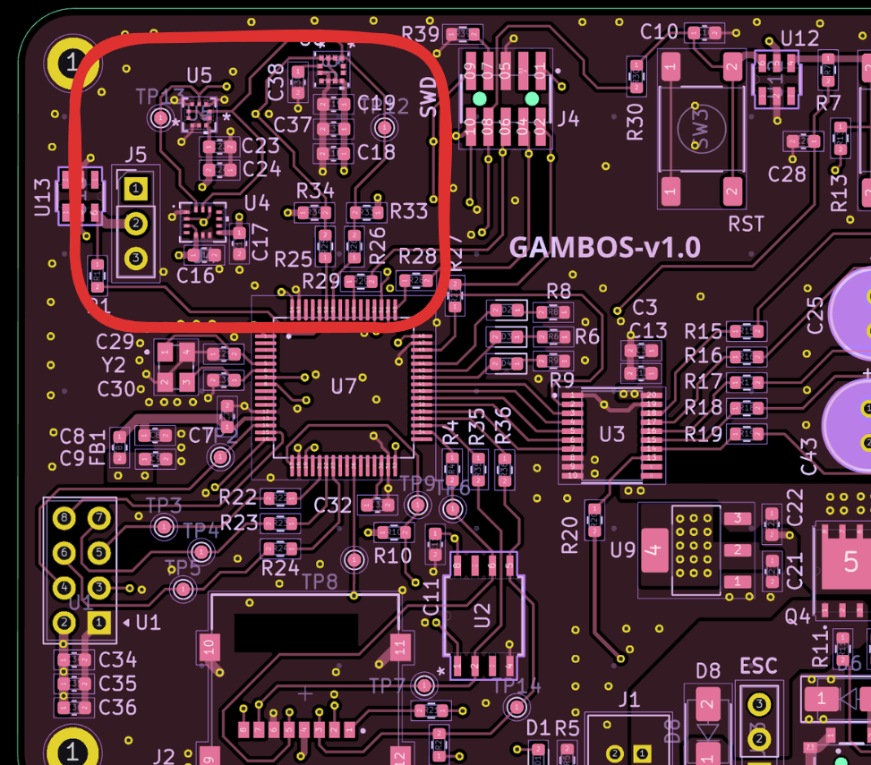

# Sensing section

The sensing section includes:

- **Accelerometer and gyroscope** (combined IMU)
- **Magnetometer**
- **Barometer** (with temperature)

## Schematic

## Communication interface and strategy

All sensors share one **I2C** bus to reduce pin count and routing complexity.

Sensors run at different sample rates, so firmware must serialize access (dedicated I2C task, mutexes or semaphores, etc.) — see the firmware tree under `software/project/`.

## Routing and layout

- Pull-ups **R33** and **R34** are **4.7 kΩ**, with alternate footprints to tune rise time if needed.
- Series **0 Ω** parts (**R25**, **R26**) support later SI experiments.

## PCB layout

---

**Next:** [User interface →](user-interface.md)

[Documentation index](../index.md)
