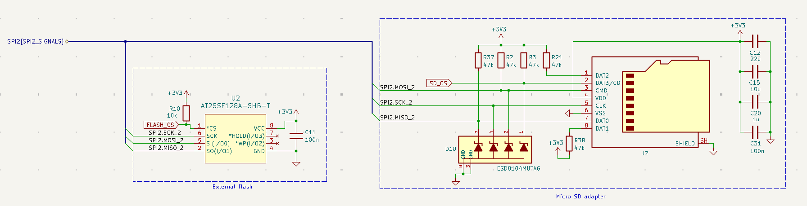
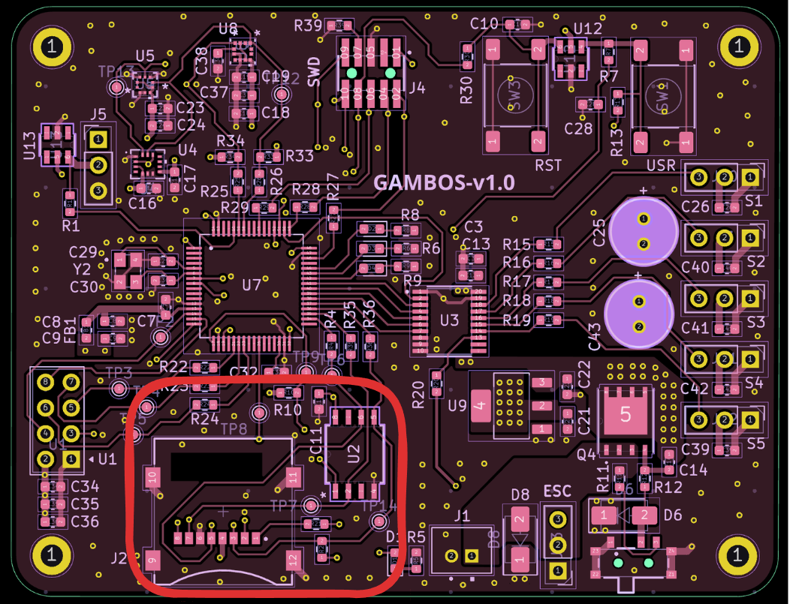

# Storage section

The storage section includes:

- **External flash** — fast non-volatile logging
- **MicroSD socket** — removable storage and post-flight data export

## Schematic

## Communication interface and strategy

Both devices share **SPI1**.

| Phase | Active device | Rationale |
|-------|---------------|-----------|
| In flight | External flash only | High-speed logging without SD card contention |
| Post flight | MicroSD | Copy logs from flash for long-term storage and analysis |

This sequencing keeps firmware bus arbitration simple during flight.

## Routing and layout

- SPI traces stay on one layer where practical; **0 Ω** series parts allow signal-integrity experiments.
- Pull-ups meet the SD card specification for stable logic levels.
- **ESD protection (D10)** on user-accessible data lines reduces risk when inserting or removing cards.

## PCB layout

---

**Next:** [Sensing →](sensing.md)

[Documentation index](../index.md)
