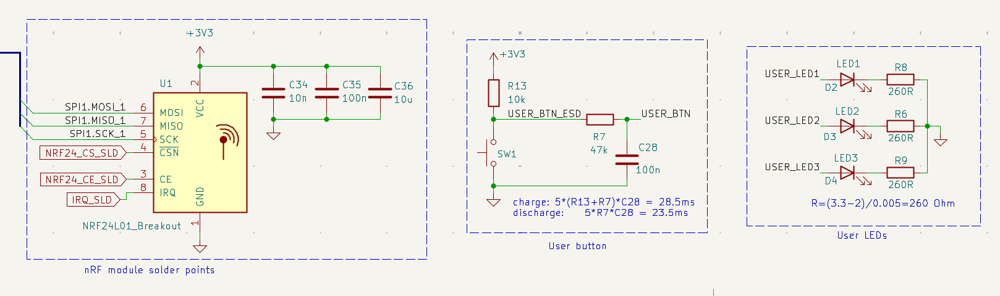

# User interface section

The user section includes:

- **nRF24L01+** RF module
- **User push button**
- **Three status LEDs** (yellow)

## Schematic

## nRF24L01+ transceiver

Handles wireless telemetry and command reception. It connects to **SPI2**; no other peripheral shares that bus, so the driver avoids SPI arbitration with storage devices.

## Push button

Hardware **RC debouncing** filters contact bounce. Used for tests, debug workflows, and triggering or stopping specific routines during bring-up.

## Status LEDs

Three LEDs give visual feedback during power-on, tests, and runtime debug.

---

**Next:** [Future improvements →](future-improvements.md)

[Documentation index](../index.md)
