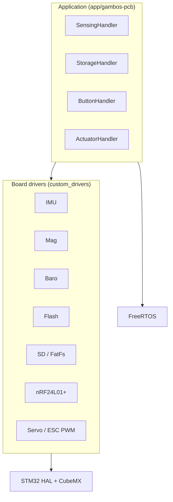

# Software architecture

Firmware for Gambos lives under [`software/`](../../software/).

| | |
| --- | --- |
| **MCU** | STM32F446 — Gambos PCB (`gambos-pcb`) |
| **Build** | CMake, FreeRTOS, STM32 HAL, C++17 |
| **Status** | Sensing, storage, and button handlers running on hardware; actuation and RF integration pending |

## Overview

Layer stack (summary — same diagram on the [repository README](../../README.md)):

<!-- Detailed PNG figure: docs/assets/software-architecture.png (when added) -->

## Repository layout

| Path | Role |
| --- | --- |
| `software/project/board/` | CubeMX upstream tree + patches → generated HAL/FreeRTOS baseline |
| `software/project/custom_drivers/` | Board-specific C++ drivers (sensors, storage, RF, PWM) |
| `software/project/app/gambos-pcb/` | Application handlers, board wiring, startup |
| `software/project/scripts/` | Build, flash, probe, clean |

## Handlers

| Handler | Responsibility |
| --- | --- |
| **SensingHandler** | Single FreeRTOS task for I2C IMU, magnetometer, barometer |
| **StorageHandler** | Flash logging, SD export, request queue and state machine |
| **ButtonHandler** | User button via EXTI |
| **ActuatorHandler** | Servo / ESC PWM (driver ready; not wired in app startup yet) |

## Getting started

**[software/README.md](../../software/README.md)** — Dev Container, build, flash, and debug.

## Related documentation

- [Repository README](../../README.md)
- [Hardware architecture](../hardware/hardware-architecture.md)
- [Roadmap](../hardware/roadmap.md)
